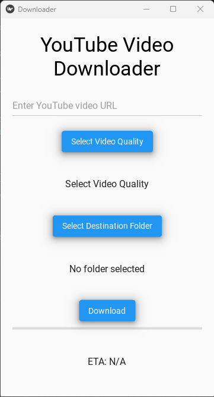

# YouTube Video Downloader - Kivy

This is a simple and elegant YouTube Video Downloader built using `Kivy` and `KivyMD`. The app allows users to input a YouTube video URL, select the desired video quality, and choose a destination folder to download the video. It features a clean UI with download progress tracking and estimated time of arrival (ETA) for downloads.




## Features

- **Responsive UI**: The app provides a responsive user interface using `KivyMD`.
- **Video Quality Selection**: Allows users to select different video qualities (144p, 240p, 360p, 480p, 720p, 1080p, 2k, 4k).
- **Destination Folder Selection**: Users can select the destination folder where the downloaded video will be saved.
- **Download Progress**: Displays download progress in real-time with a progress bar and ETA.
- **Multi-platform**: Works on Windows, macOS, Linux, and Android.

## Prerequisites

Ensure that you have the following installed:

- Python 3.7+
- `Kivy` and `KivyMD`
- `yt-dlp` for downloading videos
- `plyer` (optional for file chooser functionality on some platforms)

To install the necessary dependencies, run:

```bash
pip install -r requirements.txt
```

## Installation and Setup

1. **Clone the repository**:

```bash
git clone https://github.com/yourusername/yt-downloader-kivy.git
cd yt-downloader-kivy
```

2. **Install Dependencies**:

Install the required Python packages using pip:

```bash
pip install -r requirements.txt
```

3. **Run the Application**:

```bash
python main.py
```

## How to Use

1. Launch the application.
2. Enter the YouTube video URL in the provided text field.
3. Click on `Select Video Quality` to choose the desired quality.
4. Click on `Select Destination Folder` to specify where the video will be downloaded.
5. Press the `Download` button to start downloading the video.
6. The app will display the download progress and the estimated time to complete (ETA).

## Project Structure

```
YT_Downloader_Kivy/
│
├── main.py                     # Main Python file that contains the app logic
├── README.md                   # This file
├── requirements.txt            # Python package requirements
└── assets/                     # Optional folder for storing assets (if any)
```

## Screenshots


## Contributing

If you want to contribute to this project, feel free to submit a pull request. Contributions are always welcome!

## License

This project is licensed under the MIT License. See the [LICENSE](LICENSE) file for more details.

## Contact

For any issues or inquiries, feel free to reach out:

- **Email**: youremail@example.com
- **GitHub**: [yourusername](https://github.com/yourusername)
